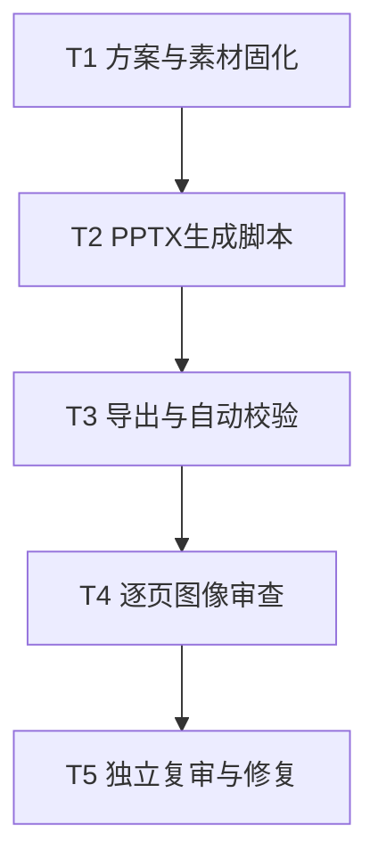

## Spec

### Goal

重新制作一套 8 页、16:9 的正式企业 AI 解决方案 PPT，面向企业主和管理层，重点说明公司做什么、怎样落地、已有案例与合作方式。

### Scope

- 保留当前暖白底、砖红强调色的社论式风格，不覆盖旧版。
- 将“服务体系”和“落地流程”合并为一页，整套压缩为 8 页。
- 使用 TikTok 商业化 Agent 平台、TikTok Shop 广告诊断 Agent、保诚保险团队智能工作台三个案例。
- 平台案例使用 12+、65%、75% 三项成果数据；广告诊断案例使用 30+、3 分钟以内、60% 三项成果数据。
- 交付可编辑 PPTX，并保留最终 HTML/PDF 预览路径如环境支持。

### Non-Goals

- 不制作通用企业 AI 应用场景页。
- 不在页面上显示“占位”、“待确认”、“演示数据”、“已脱敏”等内部说明。
- 不伪造保诚小程序截图；在没有真实截图时使用正式的文字与流程结构。

### Solution

1. 封面：大标题与真实产品界面抽样，建立专业与真实感。
2. 真实难题：使用已选的 B 版结论先行布局。
3. 服务与落地路径：两种进入方式汇入五阶段交付链路。
4. TikTok 商业化 Agent 平台：左侧挑战与方案，右侧真实平台截图，底部三项量化成果。
5. TikTok Shop 广告诊断 Agent：左侧挑战，右侧 Ad Assistant 截图，底部诊断数据与三项成果。
6. 保诚保险团队智能工作台：用团队社区、知识问答、智能计划书三个大型文字模块表达真实功能。
7. 优势与团队：上部四项优势，下部三位核心成员。
8. 合作方式：左右双入口，以预约业务场景访谈作为收尾。

### Error Handling

- 若中文字体不可用，使用本机可用的 Noto Sans CJK SC 或 PingFang SC，不使用拉丁字体代替中文。
- 若截图裁切后丢失主要信息，优先保留 Agent 对话与主要指标区域，不拉伸图片。
- 若文本溢出，优先精简文案或调整分栏，正文不小于 17pt。
- 若 PPTX 最终校验失败，修复生成脚本并生成新版本，不直接修改最终产物。

### Acceptance Criteria

- 最终 PPTX 共 8 页，顺序与上述方案一致。
- 页标题清晰，没有小于 17pt 的主要正文。
- 页面无意外文本溢出、重叠、裁切、破图或未解析占位符。
- 第 4、5 页使用真实项目截图，并分别展示三项量化成果。
- 第 6 页内容与《保险小助手小程序用户手册》一致。
- 通过 PPTX 包完整性、几何布局和字体校验，并完成逐页图像审查与独立复审。

## Implementation Plan

# 企业AI解决方案PPT Spec and Implementation Plan

> **For agentic workers:** REQUIRED SUB-SKILL: Use superpowers:subagent-driven-development to implement this plan task-by-task.

**Goal:** 生成并验证一套 8 页正式企业 AI 解决方案 PPTX。

**Architecture:** 使用 JavaScript ES Module 与 `@oai/artifact-tool` 原生生成可编辑 PPTX。真实项目截图作为图像证据，其余标题、正文、流程和数据均保持为原生可编辑元素。

**Tech Stack:** JavaScript ES Modules, `@oai/artifact-tool`, bundled Node.js/Python runtime, PowerPoint PPTX.

---

### Execution Graph

### Task 1: 方案与素材固化

**Node:** T1

**Execution Group:** Wave 1

**Files:**
- Create: `/Users/devin/projects/企业AI解决方案PPT/方案与执行计划.md`
- Read: `/Users/devin/projects/企业AI解决方案PPT/assets/*.png`
- Read: `/Users/devin/.codex/attachments/050dc6f3-2c1b-4058-88cf-8321b312497f/保险小助手小程序用户手册.docx`

- [x] **Step 1:** 固化 8 页内容、数据、素材和验收标准。
- [x] **Step 2:** 确认所有必需截图文件可读，并记录尺寸。

### Task 2: PPTX生成脚本

**Node:** T2

**Execution Group:** Wave 2

**Files:**
- Create: `/Users/devin/projects/企业AI解决方案PPT/.build-v2/build-deck.mjs`
- Create: `/Users/devin/projects/企业AI解决方案PPT/.build-v2/candidate.pptx`

- [x] **Step 1:** 实现 16:9 幻灯片和统一设计 token。
- [x] **Step 2:** 实现 8 页文字、线条、数据和图片布局。
- [x] **Step 3:** 导出候选 PPTX。

### Task 3: 导出与自动校验

**Node:** T3

**Execution Group:** Wave 3

**Files:**
- Create: `/Users/devin/projects/企业AI解决方案PPT/output/企业AI解决方案介绍-V5-final.pptx`
- Create: `/Users/devin/projects/企业AI解决方案PPT/.codex-finalizer/*.validation.json`

- [x] **Step 1:** 宣告 8 页、无必需原生表格和图表、中文字体策略。
- [x] **Step 2:** 运行 finalizer 生成新的最终文件。
- [x] **Step 3:** 确认完整性、几何布局、字体和 Artifact Tool 导入验证通过。

### Task 4: 逐页图像审查

**Node:** T4

**Execution Group:** Wave 4

**Files:**
- Create: `/Users/devin/projects/企业AI解决方案PPT/.review-v5-final/slide-*.png`

- [x] **Step 1:** 渲染全部 8 页为 PNG。
- [x] **Step 2:** 检查标题层级、文字可读性、页面密度、截图裁切与空白。
- [x] **Step 3:** 如有问题，修改生成脚本并重新导出新版本。

### Task 5: 独立复审与修复

**Node:** T5

**Execution Group:** Wave 5

**Files:**
- Read: `/Users/devin/projects/企业AI解决方案PPT/.review-v5-final/slide-*.png`
- Modify: `/Users/devin/projects/企业AI解决方案PPT/.build-v2/build-deck.mjs`
- Create: `/Users/devin/projects/企业AI解决方案PPT/output/企业AI解决方案介绍-V5-final.pptx`

- [x] **Step 1:** 将逐页截图交给独立复审者，检查叙事、排版、真实性和管理层可读性。
- [x] **Step 2:** 验证复审意见，修复成立问题。
- [x] **Step 3:** 重新渲染修复后全部页面，完成最终核对。

## Todo

- [x] Task 1: 方案与素材固化
- [x] Task 2: PPTX生成脚本
- [x] Task 3: 导出与自动校验
- [x] Task 4: 逐页图像审查
- [x] Task 5: 独立复审与修复
